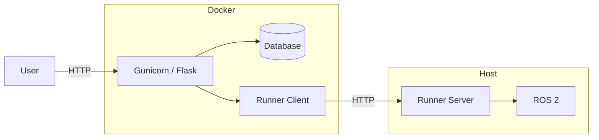

# ros2log

## Architecture

The Flask application runs in Docker and sends finite ROS 2 commands to a
small command runner over HTTP. During development the runner and random test
topics run in a Jazzy container. In production the runner executes directly on
the ROS 2 host.



See [DOCUMENTATION.md](DOCUMENTATION.md) for the project structure and coding
guide.

## Configuration

Edit settings directly in `config.py`:

- `APP_ENV`: `"development"` or `"production"`.
- `ROS2_COMMAND_TIMEOUT`: maximum duration of a finite ROS 2 command.


## Development

Start the application, Jazzy command runner, and random test topics:

```bash
docker compose --profile development up --build
```

Open <http://localhost:5000>.

Check whether Flask can reach the command runner at <http://localhost:5000/api/ros2/health>.

## Production

Set `APP_ENV = "production"` in `config.py`. On the host, open a terminal where
ROS2 and any required workspace are configured, then start the runner:

```bash
python3 -m runner.server
```

In another terminal, start the Flask application:

```bash
docker compose up --build
```

## Tests

```bash
docker-compose build app # ensure latest changes
docker compose run --rm app pytest
```
