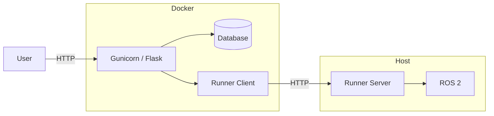

# ros2log

## Architecture

The Flask application runs in Docker and sends time-limited ROS 2 commands to a
small command runner over HTTP. During development the runner and random test
topics run in a Jazzy container. In production the runner executes directly on
the ROS 2 host. The runner also supports one background command for operations
such as recording a ROS bag. The dashboard lists topics and controls recordings;
the recordings page provides saved bag information and parsed metadata.


```mermaid
flowchart LR
    User[User] -->|HTTP| App

    subgraph Docker
        App[Gunicorn / Flask]
        DB[(Database)]
        Client[Runner Client]

        App --> DB
        App --> Client
    end

    subgraph Host
        Runner[Runner Server]
        ROS[ROS 2]
    end

    Client -->|HTTP| Runner
    Runner --> ROS
```

See [DOCUMENTATION.md](DOCUMENTATION.md) for the project structure and coding
guide.

## Configuration

Edit settings directly in `config.py`:

- `APP_ENV`: `"development"` or `"production"`.
- `ROS2_COMMAND_TIMEOUT`: maximum duration of a finite ROS 2 command.
- `ROS2_EXECUTABLE_PATH`: path to the runner's `ros2` executable; leave as `None`
  to find `ros2` through `PATH` as before. Applies to finite and background commands.
- `PERFORMANCE_POLL_INTERVAL_SECONDS`: browser performance refresh interval;
  defaults to 300 seconds.
- `RECORDING_TIMEOUT_SECONDS`: maximum duration of a recording.
- `TOPIC_MONITOR_WINDOW`: default and allowed message-count window for topic measurements.
- `STORAGE_PATH`: absolute path to shared storage as seen by the Flask app and
  its container; defaults to `/storage`. Recordings and `app.db` live under it.
- `RUNNER_STORAGE_PATH`: host directory for production recordings. Defaults to
  `./storage` in the repository. Change this setting in `config.py` to choose
  another directory; use an absolute path for a directory outside the repository.

The host path and container path are separate. In `compose.yaml`, the shared
volume maps `./storage` (relative to the Compose project directory) to
`/storage` in both development containers. To move only the host files, change
the host side of `x-storage-volume`; `STORAGE_PATH` stays `/storage`. To change
the path seen inside the containers, change `STORAGE_PATH` in `config.py` and
the container side of `x-storage-volume` to the same absolute path. Also update
the directory created in `docker/Dockerfile`. Rebuild both images after editing
`config.py`, since each image copies it at build time.

In production the ROS 2 runner converts recording outputs under `STORAGE_PATH`
to `RUNNER_STORAGE_PATH` on the host. Set the host side of `x-storage-volume` in
`compose.yaml` to that same host directory so Flask can read the recordings.
Existing recording paths are saved as absolute paths in SQLite; moving the
container path also requires moving the data and updating those rows, or
retaining the old path as a link. Changing `STORAGE_PATH` also changes the
default persistent database location (`<STORAGE_PATH>/app.db`). Keep the old
database when moving storage.

The ignore rules in `.gitignore` and `.dockerignore` refer to the default host
`storage` folder. Update them if you move host storage within the project.


## Development

Start the application, Jazzy command runner, and sample ROS 2 topics:

```bash
docker compose --profile development up --build
```

Open <http://localhost:5000>.

Check runner connectivity at <http://localhost:5000/api/ros2/health>.

## Quick start

1. Refresh the Topics list and select the ROS 2 topics you want to use.
2. In Recording, optionally enter a prefix, then start and stop a bag recording.
    With the development Compose setup, recordings are saved under `./storage`
    on the host, mounted as `/storage` in the containers.
3. On the Recordings page, view a recording's metadata or rename and delete it.
4. In Topic Monitor, choose one of the selected topics and measure its message
    frequency (Hz) and bandwidth (B/s). The monitor displays measurements rather
    than graphs.

## Production

Set `APP_ENV = "production"` in `config.py`. By default, recordings and `app.db`
are stored in the repository's `./storage` directory. To use another host
directory, edit `RUNNER_STORAGE_PATH` in `config.py`:

```python
RUNNER_STORAGE_PATH = Path("/data/ros2log")
```

Then point the host side of `x-storage-volume` in `compose.yaml` at the same
directory, leaving the container side as `/storage`:

```yaml
x-storage-volume: &storage-volume /data/ros2log:/storage
```

On native Linux, prepare the host directory before starting either process.
Use your configured host directory instead of `storage` if you changed it:

```bash
mkdir -p storage
sudo chown "$(id -u):10001" storage
sudo chmod 2775 storage
```

The runner owns the directory, while Flask uses GID 10001. The `2` in `2775`
keeps new recording folders in that group. Start the runner with `umask 002`
so Flask can rename and delete those folders. On the host, open a terminal
where ROS2 and any required workspace are configured, then run:

```bash
umask 002
python3 -m runner.server
```

In another terminal, start the Flask application:

```bash
docker compose up --build
```

The dashboard and Recordings page show the host recording path in production;
SQLite keeps the container path so Flask can read and manage the files. See
[DOCUMENTATION.md](DOCUMENTATION.md) for the background command protocol.

## Tests

Run the test suite in the application container:

```bash
docker compose run --build --rm app pytest
```

Run status polling tests with Node.js:

```bash
node --test test/test_ros2_status_ui.cjs
```
