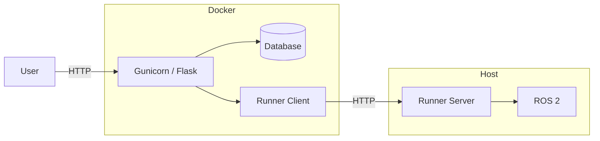

# ros2log
A frontend for creating and managing ros2 bag recordings.

## Quickstart
1. Refresh the Topics list and select the ROS 2 topics you want to use.
2. In Recording, optionally enter a prefix, then start and stop a bag recording.
    With the development Compose setup, recordings are saved under `./storage`
    on the host, mounted as `/storage` in the containers.
3. On the Recordings page, view a recording's metadata or rename and delete it.
4. In Topic Monitor, choose one of the selected topics and measure its message
    frequency (Hz) and bandwidth (B/s). The monitor displays measurements rather
    than graphs.

## Configuration
The application sources `config.py` for options, these are documented in the file itself.

| Key | Value | Description / Default |
|------------|-------|-----------------------------|
| `APP_ENV` | `"development"` or `"production"` | Application mode. |
| `RUNNER_STORAGE_PATH` | Directory path | Production recording directory. Default: `./storage`. |
| `ROS2_COMMAND_TIMEOUT` | Seconds | Timeout for finite ROS 2 commands. |
| `RECORDING_TIMEOUT_SECONDS` | Seconds | Maximum recording duration. |
| `ROS2_EXECUTABLE_PATH` | Path or `None` | ROS 2 executable; `None` uses `PATH`. |


## Setup
- Set `APP_ENV = "production"` in `config.py`.

Prepare the storage directory:
```bash
mkdir -p storage
sudo chown "$(id -u):10001" storage
sudo chmod 775 storage
```

<details>
<summary>Use a different storage directory</summary>

Recordings and `app.db` default to `./storage`. To change this, update `config.py`:

```python
RUNNER_STORAGE_PATH = Path("/data/ros2log")
```

Update the host path in `compose.yaml`, keeping `/storage` as the container path:

```yaml
x-storage-volume: &storage-volume /data/ros2log:/storage
```

Use your chosen directory in the setup commands above.

</details>

Start the runner:

```bash
python3 -m runner.server
```

Start the application:

```bash
docker compose up --build
```

Access the interface: <http://localhost:5000> (or wherever the service is bound)

## Development

Start the application, Jazzy command runner, and sample ROS 2 topics:

```bash
docker compose --profile development up --build
```

Check runner connectivity at <http://localhost:5000/api/ros2/health>.


##### Architecture

The Flask application runs in Docker and sends time-limited ROS 2 commands to a
small command runner over HTTP. During development the runner and random test
topics run in a Jazzy container. In production the runner executes directly on
the ROS 2 host. The runner also supports one background command for operations
such as recording a ROS bag. The dashboard lists topics and controls recordings;
the recordings page provides saved bag information and parsed metadata.


```mermaid
flowchart LR
    User[User] -->|HTTP| App

    subgraph Docker
        App[Gunicorn / Flask]
        DB[(Database)]
        Client[Runner Client]

        App --> DB
        App --> Client
    end

    subgraph Host
        Runner[Runner Server]
        ROS[ROS 2]
    end

    Client -->|HTTP| Runner
    Runner --> ROS
```

##### Storage
The host path and container path are separate. In `compose.yaml`, the shared
volume maps `./storage` (relative to the Compose project directory) to
`/storage` in both development containers. To move only the host files, change
the host side of `x-storage-volume`; `STORAGE_PATH` stays `/storage`. To change
the path seen inside the containers, change `STORAGE_PATH` in `config.py` and
the container side of `x-storage-volume` to the same absolute path. Also update
the directory created in `docker/Dockerfile`. Rebuild both images after editing
`config.py`, since each image copies it at build time.

In production the ROS 2 runner converts recording outputs under `STORAGE_PATH`
to `RUNNER_STORAGE_PATH` on the host. Set the host side of `x-storage-volume` in
`compose.yaml` to that same host directory so Flask can read the recordings.
Existing recording paths are saved as absolute paths in SQLite; moving the
container path also requires moving the data and updating those rows, or
retaining the old path as a link. Changing `STORAGE_PATH` also changes the
default persistent database location (`<STORAGE_PATH>/app.db`). Keep the old
database when moving storage.

#### Tests

Run the test suite in the application container:

```bash
docker compose run --build --rm app pytest
```

Run status polling tests with Node.js:

```bash
node --test test/test_ros2_status_ui.cjs
```
